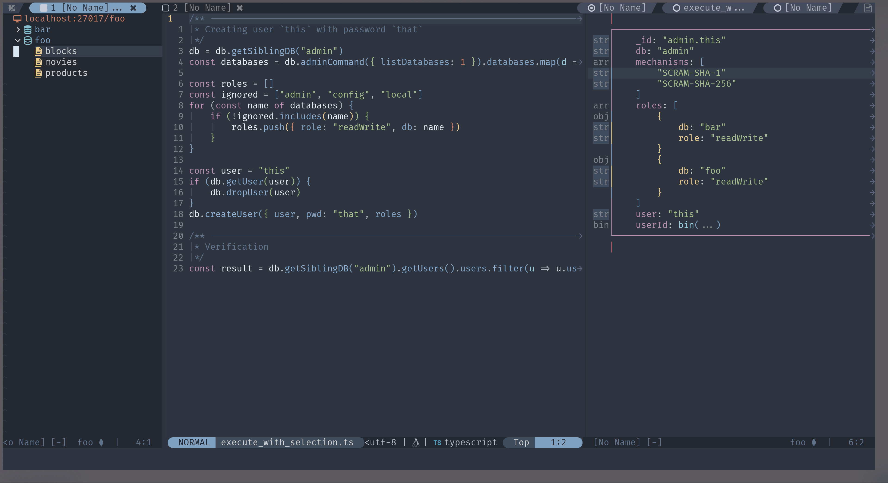

# mongosh.nvim

This is a frontend for mongosh. It provides your the ability to send script to
mongosh and inspect executation result in NeoVim.

You can:

- Connecting to database with authentication.
- Browsing available databases and collections in sidebar.
- Execute, make query, edit document with content in current buffer.
- Refresh your query result buffer after some data operations.
- Check your query result with card view, and edit them right under your cursor.

Following option can be customized:

- Executable path of `mongsh`.
- Indent size for JSON result.
- How result window splits current view.
- Action on new buffer gets created by plugin, you can set keymap in new buffer
or do other things of your interest.
- Highlight used by sidebar and card view.

## Installation

To use this plugin, you need to have `mongosh` executable on your machine.

Then, install this plugin with plugin manager of your choice.

## Configuration

User config table can be passed to plugin as follow:

```lua
require "mongosh-nvim".setup {
    -- your config here
    executable = "/usr/local/bin/mongosh"
    connection = {
        default_db_addr = "192.168.1.10:10001"
    }
}
```

Default config value and introduction of each option can be found [here](https://github.com/SirZenith/mongosh.nvim/blob/main/lua/mongosh-nvim/config.lua).

## Usage

Check out `:help mongosh-nvim` or [this doc](./doc/mongosh-nvim.md).

Basically, this plugin provides command `:Mongo` as entrance, and several
subcommands that actually do something.

Screen shot (click to jump to video):

[](https://youtu.be/mKPvMBQuZy4 )

## Thanks

This plugin is inspired by [jrop/mongo.nvim](https://github.com/jrop/mongo.nvim).
